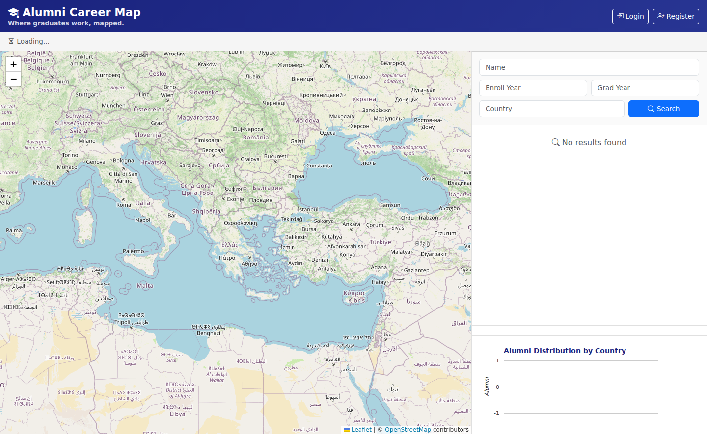
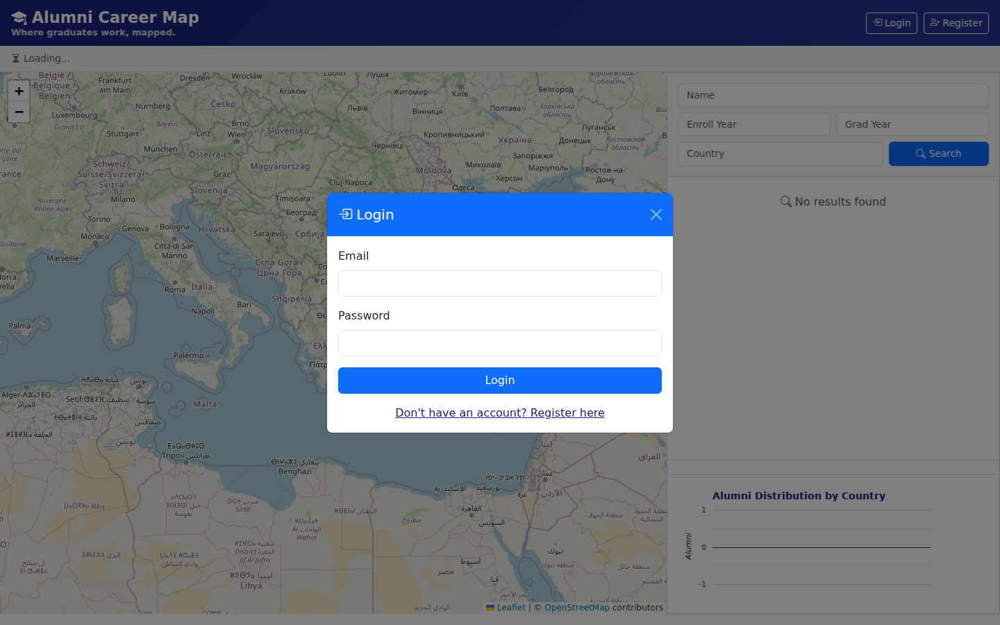
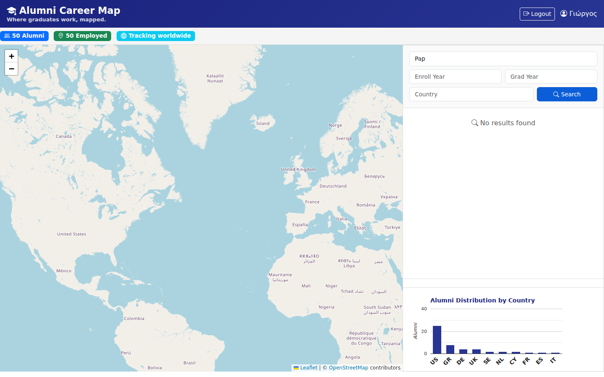

# 🗺️ Alumni Career Map

**Where did everybody end up?** A platform that pins every graduate's current job on a world map — then turns it into searchable, live data. A small side project built to explore maps + APIs + JWT in one go.

> Built as an individual project during my MSc studies.
> All seed data is synthetic 👤 fake names, `@example.com` emails, fictional companies — safe to browse and demo.

# Badges

      

[](#-docker-recommended)
[](https://www.youtube.com/watch?v=YOUR_DEMO_VIDEO_ID)


---

## 📸 Demo

> Live capture from the running Docker stack — generated with the [Playwright capture script](screenshots/README.md).

> **ℹ️ About the demo:** the Live Demo badge points to `localhost:8081` — the app currently runs **locally via Docker Compose**, not on a hosted server (so there is no uptime to monitor yet). To see it live yourself:
>
> ```bash
> docker compose up -d --build   # → http://localhost:8081
> ```
>
> A hosted demo with a status page is on the [roadmap](#-roadmap).

| 🗺️ Interactive map (Leaflet + OpenStreetMap) | 🔐 JWT login |
|:---:|:---:|
|  |  |

| 🔍 Multi-criteria search (pagination, JSON/XML API) |
|:---:|
|  |

---

## ✨ What it does

Ever wondered "what do graduates do with their degree"? **Alumni Career Map** answers that in two clicks:

- 🗺️ **Interactive map** — every alumnus' current job pinned with real-world coordinates (Leaflet + OpenStreetMap). Zoom Athens → New York → Tokyo and watch the network light up.
- 📊 **Analytics** — a bar chart of graduate distribution by country, plus a live total count. The data tells the story.
- 🔍 **Search** — multi-criteria (name, enrollment, graduation year, country) with pagination, served as **JSON or XML**.
- 🔐 **Auth done right** — JWT login/registration, and *ownership authorization*: you can only edit your own jobs.
- 🧱 **REST API** — Slim Framework 4 (PHP) with a proper layered architecture (Controllers / Domain / Infrastructure / Middleware).

## 🧩 Stack

| Layer | Tech |
|---|---|
| Backend | PHP · **Slim 4** (routing, PSR-7, PHP-DI, Monolog) |
| Data | MySQL · utf8mb4 · seed with geo-coordinates |
| Frontend | Vanilla JS · **Bootstrap 5** · Leaflet · Charts |
| Auth | JWT (firebase/php-jwt) · bearer tokens · ownership checks |
| Ops | **Docker Compose** (root, one command) · auto-seeded MySQL · nginx reverse proxy · CI (phpcs + phpstan + phpunit) |

---

## 📁 Repository layout

```text
docker-compose.yml           one-command full stack (db + api + frontend)
.env.example                 template for overriding the dev credentials/secrets
api/                         Slim 4 REST API (PHP)
  Dockerfile                 PHP 8.3 + composer image
  app/settings.php           runtime config — reads DB/JWT from env
  sql/schema.sql             database schema
  sql/seed.sql               20 synthetic graduates + jobs
  sql/docker/                schema + seed auto-loaded by the MySQL container
  .env.example               env template (manual setup only)
frontend/                    single-page app (vanilla JS + Bootstrap 5)
  nginx.conf                 serves the app + reverse-proxies /api → API
.htaccess                    routes /api/* → Slim, everything else → frontend
```

## 🐳 Docker (recommended)

Run the **whole stack** (MySQL + API + frontend) with a single command:

```bash
docker compose up -d --build
```

- 🗺️ UI → **http://localhost:8081**
- ⚙️ API → **http://localhost:8081/api/v1** (nginx reverse-proxies `/api` → the API container, so the browser talks to one origin)
- Raw API on **http://localhost:8080** (optional)

The MySQL container creates the schema and seeds 20 synthetic alumni on first start, so you can log in right away:

> **Log in with any seeded alumnus** — email from `api/sql/seed.sql`, password **`alumni2026`**.

To stop: `docker compose down` · wipe data + rebuild seed: `docker compose down -v && docker compose up -d --build`.

> 🔑 **Credentials** default to dev values (fine for the synthetic demo). To override — e.g. for a real deployment — copy `.env.example` → `.env` and edit, or `export` the variables before `docker compose up`. Nothing else in the repo needs to change.

---

## 🚀 Manual quick start (no Docker)

1. **Database**
   ```bash
   mysql -u root -p < api/sql/schema.sql
   mysql -u root -p < api/sql/seed.sql
   mysql -u root -p < api/sql/update_schema.sql
   ```
   Then set your own passwords: copy `api/.env.example` → `api/.env` and update the `GRANT`/`CREATE USER` in `update_schema.sql` to match.

2. **API** (from `api/`)
   ```bash
   composer install
   export $(cat .env | xargs)      # loads DB_PASS / JWT_SECRET …
   php -S 0.0.0.0:8081 -t public
   ```
   …or skip all of this and use the **one-command Docker stack** above.

> ℹ️ The first `docker compose up --build` compiles PHP extensions and takes a few minutes — subsequent builds are cached and fast.

3. **Frontend** — serve `frontend/` from any static server and point `api.js` `API_BASE` at your API.

## 🔌 API at a glance

| Method | Endpoint | Auth |
|---|---|---|
| POST | `/api/v1/auth/login` | — (returns JWT) |
| POST | `/api/v1/alumni` | — (register) |
| GET | `/api/v1/alumni/count` | JWT |
| GET | `/api/v1/alumni` | JWT |
| GET | `/api/v1/alumni/search?…&format=json\|xml` | JWT |
| POST | `/api/v1/alumni/{id}/jobs` | JWT **+ owner** |
| GET | `/api/v1/alumni/{id}/jobs` | JWT |
| PUT | `/api/v1/alumni/{id}/jobs/{jobId}` | JWT **+ owner** |
| DELETE | `/api/v1/alumni/{id}/jobs/{jobId}` | JWT **+ owner** |

## 🧭 Roadmap

- ⏭️ React + MUI frontend (`leaflet-react`, Recharts, dark theme)
- ⏭️ OpenAPI / Swagger docs
- ✅ GitHub Actions CI (phpcs + phpstan + phpunit on PHP 8.2/8.3, live integration suite auto-skips without the Docker stack)

## 📄 License

[MIT](LICENSE) — free to use, remix, and build on.

## 🔗 More From Me

Also part of my portfolio:

- 💼 [JobSearch Platform](https://github.com/Alex247Git/jobsearch) — React + Express job platform with AI-matched recommendations and real-time chat
- 🔥 [Autonomous Firefighting Simulation](https://github.com/Alex247Git/autonomous-firefighting-simulation) — Mesa agent-based wildfire simulation in Python
- 🌐 [Portfolio](https://alex247git.github.io/) — live overview of all my projects

---

## 🤝 Connect with Me

I'm currently open to **full-stack** and **software engineering roles** — remote or hybrid (Greece / EU).

- 📧 [AlexAdamos247@gmail.com](mailto:AlexAdamos247@gmail.com)
- 💼 [LinkedIn — Alexandros Adamos](https://www.linkedin.com/in/alexandros-adamos-227961331/)
- 🐙 [GitHub — @Alex247Git](https://github.com/Alex247Git)
- 🌐 [Portfolio](https://alex247git.github.io/)